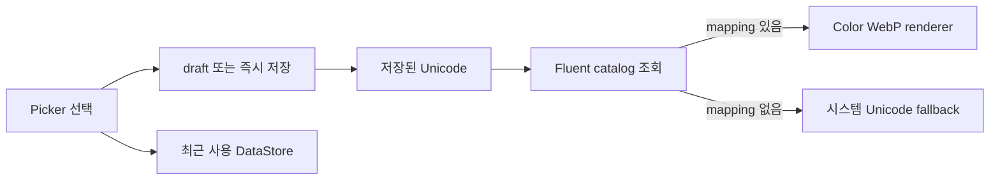

# Fluent UI Emoji 선택기 마이그레이션 전략

- 대상 이슈: #212
- 기준 브랜치: `origin/main`
- upstream: `microsoft/fluentui-emoji@62ecdc0d7ca5c6df32148c169556bc8d3782fca4`

## 목표

기존 24개 Unicode 이모지 고정 그리드를 목표 중심 Fluent UI Emoji 선택기로 교체한다. Room에는 지금처럼 Unicode 문자열만 저장해 기존 사용자 데이터와 Android/iOS 의미를 유지하고, Fluent 리소스는 UI 계층에서만 매핑한다.

## 현재 구조와 제약

- `BandalartEmojiPicker`가 24개 문자열과 4×6 레이아웃을 직접 소유한다.
- 독립 이모지 sheet는 선택 즉시 저장하지만 셀 편집 sheet는 저장 전 draft만 변경한다.
- Home header, 목록, 편집 sheet, Complete 화면은 Unicode `Text`를 각각 직접 그린다.
- Fluent 원본 전체를 번들링하면 앱 크기 예산을 크게 넘는다.
- Compose Multiplatform 공통 리소스에는 선별·변환된 raster asset만 포함한다.
- 로컬 저장소에는 앱 및 빌드에 필요한 결과물만 두며 upstream 전체 repository나 submodule은 추가하지 않는다.

## 핵심 결정

1. 저장 식별자는 `profileEmoji: String?`의 Unicode를 유지한다.
2. 첫 권장 스타일은 Fluent **Color**이며 실제 UI 크기·다크 모드 검증을 통과한 뒤 최종 확정한다.
3. 최초 카탈로그는 목표·습관 작성에 자주 쓰는 항목부터 선별하며, spike에서 100/200/300개 실제 리소스와 package overhead를 측정해 최종 개수를 정한다.
4. 리소스 파일명은 Unicode code point 기반 `fluent_<codepoints>.webp`로 고정한다.
5. 매핑이 없는 기존 값은 시스템 Unicode `Text`로 표시한다.
6. 검색용 이름·키워드·별칭과 drawable mapping은 UI/resource 계층에 둔다.
7. 최근 사용 최대 12개는 기존 KMP DataStore에 Unicode 목록으로 저장한다.

## PR 분할

현재 PR은 1단계의 재현 가능한 생성 기반과 대표 20개 예비 비교까지만 다룬다. 100/200/300개 실제 catalog artifact 측정, 20개 전체 UI 크기 비교, wireframe과 다크 모드 검토가 끝나기 전에는 1단계를 완료로 표시하지 않는다.

### 1. catalog/resource spike

- pinned upstream commit과 선별 Unicode manifest를 기록한다.
- metadata와 Color asset에서 동일한 결과물을 만드는 sync script 계약을 만든다.
- 대표 20개를 picker 32dp, 본문 22~32dp, 카드 40~48dp 기준으로 확인한다.
- 100/200/300개 압축 결과의 예상 증가량을 기록하고 v1 개수를 확정한다.
- Microsoft MIT 원문과 파생 리소스 고지를 추가한다.
- manifest 중복, Unicode/resource 누락, 안정적인 파일명을 자동 검증한다.

완료 기준:

- upstream 전체 clone 없이 결과물을 재생성할 수 있다.
- 같은 입력으로 같은 catalog와 파일명이 생성된다.
- 선택한 v1 카탈로그가 압축 artifact 증가 예산 5MB 이하를 만족한다.
- 앱 런타임 코드와 DB schema는 변경하지 않는다.

### 2. 공통 renderer

- Unicode를 입력받는 `BandalartEmoji`를 공통 UI 모듈에 추가한다.
- Fluent 리소스가 있으면 원색 asset, 없으면 Unicode fallback을 그린다.
- Home header, 목록, 편집 sheet, Complete와 공유/저장 화면의 직접 `Text`를 교체한다.
- 기존 24개 및 미등록 Unicode fallback 테스트를 추가한다.

완료 기준:

- DB migration 없이 기존 데이터가 모두 표시된다.
- Android/iOS가 같은 catalog asset을 사용한다.
- asset에 theme tint가 적용되지 않는다.

### 3. picker UI

- 전체 높이 modal bottom sheet, 검색, 카테고리, adaptive grid를 구현한다.
- 최소 48dp touch target과 선택 border/check, localized content description을 제공한다.
- 독립 sheet의 즉시 저장과 편집 sheet의 draft 저장/취소 의미를 유지한다.
- 빠른 중복 탭이 repository update를 중복 실행하지 않도록 Presenter 경계를 검증한다.

완료 기준:

- 검색·카테고리로 모든 v1 항목에 도달할 수 있다.
- 선택하지 않고 dismiss하면 값이 변경되지 않는다.
- 라이트/다크 모드와 큰 font scale에서 UI가 겹치지 않는다.

### 4. 최근 사용과 출시 검증

- 최근 사용 Unicode 최대 12개를 중복 없이 최신순으로 저장한다.
- catalog에서 제거된 값은 최근 목록에서 제외한다.
- Android/iOS 실제 렌더링, 선택·저장·공유 회귀와 release artifact 크기를 확인한다.

완료 기준:

- 재실행 후 최근 사용 순서가 유지된다.
- Internal Testing에서 기존 데이터와 신규 선택 흐름이 모두 정상이다.
- 최종 artifact 증가량과 catalog commit을 문서에 기록한다.

## 데이터 흐름

## 테스트 전략

- catalog: Unicode 중복, code point 파일명, metadata/resource 일대일 매핑
- renderer: 등록 asset과 미등록 Unicode fallback
- 검색: CLDR 이름, keyword, 한국어 alias, 빈 결과
- 최근 사용: 중복 제거, 최신순, 최대 12개, 제거된 catalog 항목 필터링
- Presenter: 즉시 저장과 draft 저장/취소, 빠른 중복 입력
- UI 수동 검증: Android/iOS, 라이트/다크, 큰 글자, 투명 asset 가장자리
- 출시 검증: 변경 전후 release AAB 및 iOS artifact 크기

## 비범위

- Fluent 전체 catalog 및 skin tone/gender variant 번들링
- runtime 네트워크 다운로드
- animated emoji
- 사용자 이미지 업로드
- Room schema 변경

## 롤백

각 단계는 독립 PR로 유지한다. renderer 또는 picker에 문제가 생기면 Unicode 저장값은 그대로 두고 UI만 기존 `Text`/24개 picker로 되돌릴 수 있다. resource pipeline 결과물 제거도 DB migration이나 데이터 복구를 요구하지 않는다.
