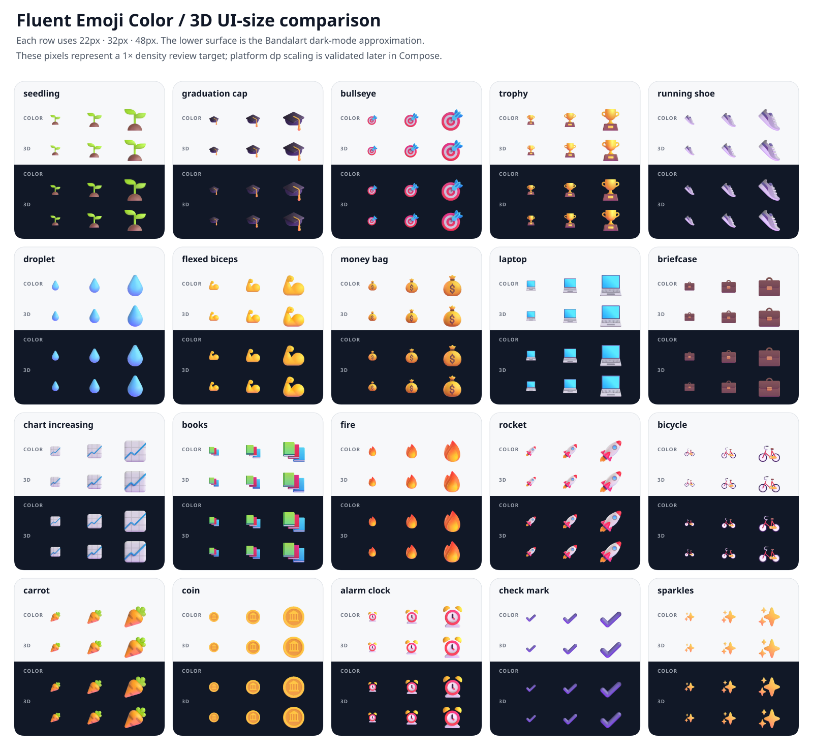
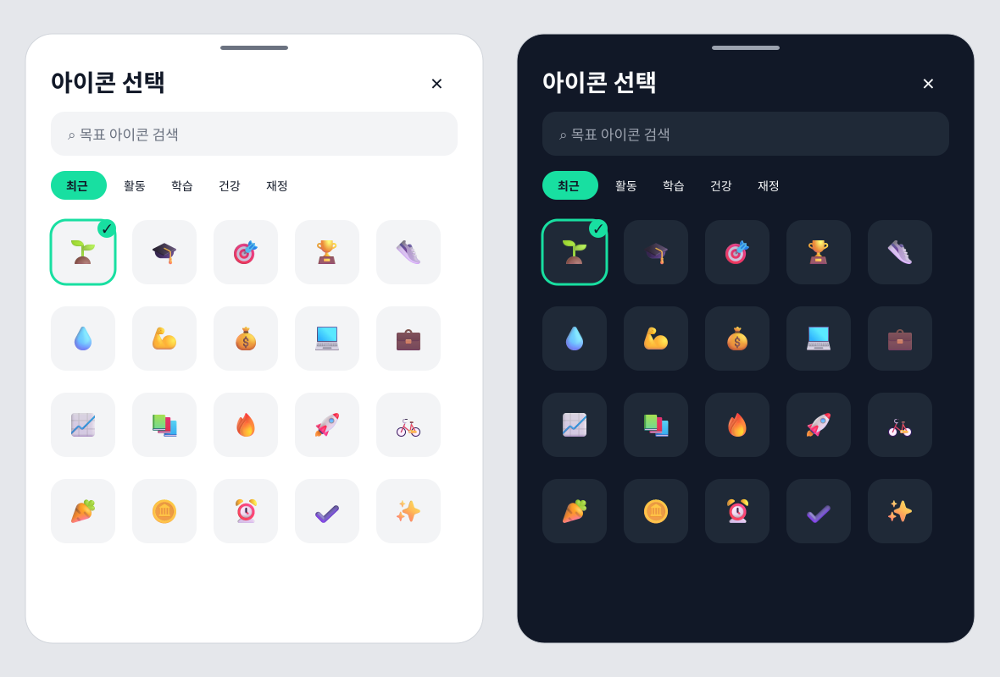

# Fluent UI Emoji 리소스 예비 spike 결과

- upstream: `microsoft/fluentui-emoji@62ecdc0d7ca5c6df32148c169556bc8d3782fca4`
- 표본: 목표·학습·운동·재정·건강 중심 20개
- 출력: 128×128px WebP, quality 92, alpha quality 100
- 재생성: `./tools/fluent-emoji/sync-spike.sh`

## 스타일 비교

| 대상 | Color | 3D |
| --- | --- | --- |
| 목표 |  |  |
| 운동 |  |  |
| 식단 |  |  |
| 성장 |  |  |

Color도 단색 flat이 아니라 Fluent 특유의 gradient와 그림자를 제공한다. 3D는 광택과 그림자가 조금 더 강하다. 현재 4개 대표 이미지를 64px로 비교했을 때 기존 반다라트의 정돈된 surface 및 cell UI에는 Color가 더 자연스러울 가능성이 높고, SVG 원본을 기준으로 출력 크기를 바꿔도 pipeline을 동일하게 유지할 수 있다.

4개 64px 예비 비교의 권장안은 **Color 단일 스타일**이었다. 아래의 20개 전체 UI 크기·라이트/다크 검증을 거쳐 최종 결정하며, 같은 릴리스에서 Color와 3D를 섞지 않는다.

20개 전체를 1× 기준 22px, 32px, 48px로 비교한 결과 Color는 작은 크기에서도 외곽 형태가 분명했고 라이트·다크 surface 모두에서 투명 가장자리가 사라지지 않았다. 3D는 일부 항목에서 광택과 깊이감이 더 강하지만 22px에서는 Color 대비 추가 정보가 거의 보이지 않았고, 항목별 입체감 편차가 더 컸다. v1 스타일은 **Color**로 확정한다. 실제 Compose에서는 동일 자산을 22dp, 32dp, 48dp로 표시하고 플랫폼 density별 rasterization을 renderer 단계에서 다시 확인한다.

## picker wireframe

- 검색 field, category chip, 5열 grid를 같은 sheet 안에 둔다.
- cell은 76px wireframe으로 그렸으며 실제 구현에서도 최소 48dp touch target을 지킨다.
- 선택 상태는 초록색 outline과 check를 함께 사용해 색상에만 의존하지 않는다.
- Fluent 원본 색상에는 tint를 적용하지 않고 surface와 선택 UI만 theme color를 사용한다.

## 용량 결과

아래 수치는 WebP 파일 자체의 합계다. Compose resource table, catalog와 앱 패키징 overhead는 포함하지 않았으므로 최종 release artifact에서 다시 측정한다.

| 스타일 | 20개 표본 | 개당 평균 | 100개 추정 | 200개 추정 | 300개 추정 |
| --- | ---: | ---: | ---: | ---: | ---: |
| Color | 57,752 B | 2,887 B | 288,760 B | 577,520 B | 866,280 B |
| 3D | 55,916 B | 2,795 B | 279,580 B | 559,160 B | 838,740 B |

20개 평균을 단순 환산하면 두 스타일 모두 300개까지 1MB 미만이지만, 이는 실제 100/200/300개 결과가 아니다. 에셋 복잡도별 편차가 있으므로 아래 payload 측정 전에는 catalog 개수를 정하지 않는다. 실제 AAB/iOS artifact 증가는 Compose resource를 연결한 뒤 최종 rollback gate로 확인한다.

- v1 후보: 100/200/300개
- 필수 목표 카테고리를 채운 뒤 중복 의미의 이모지는 제외
- 실제 100/200/300개 Color 결과물과 ZIP payload를 측정
- renderer 단계에서 변경 전후 release AAB/iOS artifact를 측정
- 최종 artifact 증가가 5MB를 넘으면 200개까지 우선 축소

### 실제 100/200/300개 Color 측정

목표 관련 keyword를 우선하고 Fluent metadata group별 quota를 적용하되 male/female sign 및 man/woman person code point를 포함한 성별 변형은 제외해 300개를 선정했다. 300개를 한 번 실제 변환한 뒤 동일한 순서의 선두 100/200/300개를 측정했다. ZIP은 WebP와 catalog JSON만 포함한 payload proxy이며 Compose resource table, native binary와 store 최적화가 포함된 AAB/IPA 자체는 아니다.

| 개수 | Color WebP | catalog JSON | 입력 합계 | ZIP payload |
| ---: | ---: | ---: | ---: | ---: |
| 100 | 315,670 B | 46,103 B | 361,773 B | 335,186 B |
| 200 | 627,978 B | 90,763 B | 718,741 B | 665,642 B |
| 300 | 935,622 B | 134,374 B | 1,069,996 B | 991,213 B |

300개도 ZIP payload가 1MB 미만이고 200개 대비 증가는 325,571B에 불과하다. 검색과 카테고리의 선택 폭을 확보하는 편익이 더 크므로 v1 catalog는 **300개**로 확정한다. 최종 AAB/iOS artifact 증가는 자산을 Compose resource로 옮기는 renderer 단계에서 다시 측정하며 5MB 예산을 넘으면 200개로 축소한다.

## 1단계 완료 상태

- [x] pinned upstream에서 대표 20개 Color/3D 생성
- [x] 20개 표본의 WebP 파일 크기와 선형 추정 기록
- [x] Unicode/resource 중복과 재생성 결정성 검증
- [x] 라이선스와 파생 리소스 출처 기록
- [x] 20개 전체를 22/32/48dp에 대응하는 1× 크기에서 Color/3D 비교
- [x] 라이트/다크 surface의 투명 가장자리와 대비 비교
- [x] picker wireframe 검토
- [x] 실제 100/200/300개 Color 결과물과 ZIP payload 측정
- [x] v1 스타일 Color와 catalog 300개 확정

## pipeline 검증 결과

- upstream 전체 clone 없이 manifest에 명시된 파일만 받는다.
- source commit, Color SVG와 3D PNG 경로를 catalog에 기록한다.
- Unicode code point 기반 resource key를 생성한다.
- 중복 Unicode/resource key와 표본 개수를 실행 시 검증한다.
- CLDR 이름, group, keyword와 한국어 alias를 같은 catalog에 보존한다.
- Microsoft MIT 전문과 파생 리소스 고지를 repository에 포함한다.

## 다음 단계

1. 확정한 Color 300개를 KMP Compose resource로 옮긴다.
2. 공통 `BandalartEmoji` renderer와 Unicode fallback을 적용한다.
3. 변경 전후 AAB/iOS artifact 증가량을 측정해 5MB 예산을 최종 확인한다.
4. renderer가 안정된 뒤 검색·카테고리·최근 사용 picker를 연결한다.
