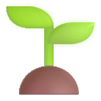

# Fluent UI Emoji 리소스 예비 spike 결과

- upstream: `microsoft/fluentui-emoji@62ecdc0d7ca5c6df32148c169556bc8d3782fca4`
- 표본: 목표·학습·운동·재정·건강 중심 20개
- 출력: 128×128px WebP, quality 92, alpha quality 100
- 재생성: `./tools/fluent-emoji/sync-spike.sh`

## 스타일 비교

| 대상 | Color | 3D |
| --- | --- | --- |
| 목표 |  |  |
| 운동 |  |  |
| 식단 |  |  |
| 성장 |  |  |

Color도 단색 flat이 아니라 Fluent 특유의 gradient와 그림자를 제공한다. 3D는 광택과 그림자가 조금 더 강하다. 현재 4개 대표 이미지를 64px로 비교했을 때 기존 반다라트의 정돈된 surface 및 cell UI에는 Color가 더 자연스러울 가능성이 높고, SVG 원본을 기준으로 출력 크기를 바꿔도 pipeline을 동일하게 유지할 수 있다.

따라서 현 단계의 권장안은 **Color 단일 스타일**이다. 20개 전체를 실제 22/32/48dp와 라이트/다크 surface에서 확인하기 전에는 최종 결정으로 간주하지 않는다. 최종 선택 후에도 같은 릴리스에서 Color와 3D를 섞지 않는다.

## 용량 결과

아래 수치는 WebP 파일 자체의 합계다. Compose resource table, catalog와 앱 패키징 overhead는 포함하지 않았으므로 최종 release artifact에서 다시 측정한다.

| 스타일 | 20개 표본 | 개당 평균 | 100개 추정 | 200개 추정 | 300개 추정 |
| --- | ---: | ---: | ---: | ---: | ---: |
| Color | 57,752 B | 2,887 B | 288,760 B | 577,520 B | 866,280 B |
| 3D | 55,916 B | 2,795 B | 279,580 B | 559,160 B | 838,740 B |

20개 평균을 단순 환산하면 두 스타일 모두 300개까지 1MB 미만이지만, 이는 실제 100/200/300개 결과가 아니다. 에셋 복잡도별 편차와 iOS/Android 패키징 overhead가 있으므로 아래 항목을 끝내기 전에는 catalog 개수를 확정하지 않는다.

- v1 후보: 100/200/300개
- 필수 목표 카테고리를 채운 뒤 중복 의미의 이모지는 제외
- 실제 100/200/300개 Color 결과물과 release AAB/iOS artifact를 측정
- 최종 artifact 증가가 5MB를 넘으면 200개까지 우선 축소

## 1단계 완료 상태

- [x] pinned upstream에서 대표 20개 Color/3D 생성
- [x] 20개 표본의 WebP 파일 크기와 선형 추정 기록
- [x] Unicode/resource 중복과 재생성 결정성 검증
- [x] 라이선스와 파생 리소스 출처 기록
- [ ] 20개 전체를 22/32/48dp에서 Color/3D 비교
- [ ] 라이트/다크 surface의 투명 가장자리와 대비 비교
- [ ] picker wireframe 검토
- [ ] 실제 100/200/300개 Color 결과물과 package overhead 측정
- [ ] v1 스타일과 catalog 개수 최종 확정

## pipeline 검증 결과

- upstream 전체 clone 없이 manifest에 명시된 파일만 받는다.
- source commit, Color SVG와 3D PNG 경로를 catalog에 기록한다.
- Unicode code point 기반 resource key를 생성한다.
- 중복 Unicode/resource key와 표본 개수를 실행 시 검증한다.
- CLDR 이름, group, keyword와 한국어 alias를 같은 catalog에 보존한다.
- Microsoft MIT 전문과 파생 리소스 고지를 repository에 포함한다.

## 다음 단계

1. 대표 20개 전체를 실제 UI 크기·라이트/다크 surface에서 비교하고 picker wireframe을 검토한다.
2. 목표 중심 후보 catalog로 100/200/300개 실제 리소스와 package overhead를 측정한다.
3. 스타일과 v1 catalog 개수를 확정한 뒤 생성 WebP를 KMP Compose resource로 옮긴다.
4. 공통 `BandalartEmoji` renderer와 Unicode fallback부터 적용한다.
5. renderer가 안정된 뒤 검색·카테고리·최근 사용 picker를 연결한다.
