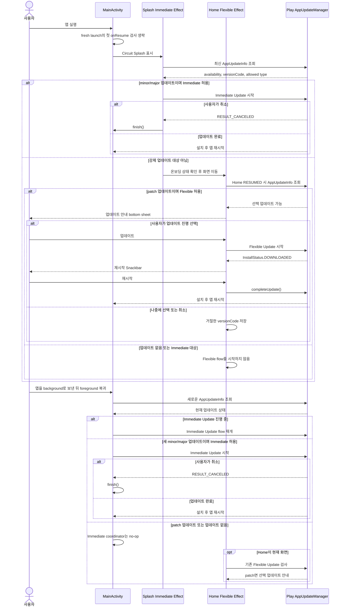

# In-App Update foreground 보강 전략

- 관련 이슈: #186
- 기준 브랜치: `main`
- 대상 플랫폼: Android

## 문제

현재 업데이트 책임은 화면별로 나뉘어 있다.

- `Splash`: cold start에서 minor/major 변경을 Immediate Update로 검사한다.
- `Home`: `RESUMED`마다 patch 변경을 Flexible Update로 검사하고 다운로드 완료 Snackbar를 처리한다.

앱 프로세스가 살아 있는 상태에서 사용자가 다른 앱으로 이동했다가 돌아왔을 때 새 minor/major 업데이트가 배포되면, `Splash`는 이미 back stack에서 제거돼 Immediate Update를 다시 검사하지 않는다. `Home`의 검사는 해당 버전을 의도적으로 Flexible 대상에서 제외하므로 아무 flow도 시작하지 않는다.

## 성공 기준

- 새 프로세스의 cold start에서는 기존 Splash Immediate Update UX를 유지한다.
- 프로세스가 살아 있는 앱이 foreground로 복귀할 때 화면 위치와 관계없이 Immediate Update를 검사한다.
- 진행 중인 Immediate Update가 있으면 공식 가이드대로 복귀 시 재개한다.
- patch Flexible Update의 안내 bottom sheet, 다운로드, 설치 Snackbar 동작은 변경하지 않는다.
- 동일 resume에서 update flow를 중복 실행하지 않는다.

## 결정

전체 Flexible UI까지 앱 root로 옮기지 않고, Android `MainActivity`가 **foreground Immediate Update coordinator** 역할만 맡는다.

이유:

- foreground/background lifecycle은 화면보다 Activity가 안정적으로 소유한다.
- Onboarding, Home, Complete 중 어떤 화면에 있어도 검사할 수 있다.
- 이미 Internal Testing으로 검증한 Home Flexible Update UI와 거절 이력 저장 경로를 변경하지 않는다.
- Splash의 최초 차단 UX를 유지하면서 관측된 누락만 작게 보강한다.

## 상태 우선순위

`MainActivity.onResume()`에서 최초 fresh launch를 제외하고 새 `AppUpdateInfo`를 조회한 뒤 다음 순서를 적용한다.

1. `DEVELOPER_TRIGGERED_UPDATE_IN_PROGRESS`
   - Immediate Update flow를 재개한다.
2. `UPDATE_AVAILABLE`
   - 현재/신규 versionCode의 major 또는 minor가 달라지고 Immediate가 허용되면 flow를 시작한다.
3. 그 외
   - 아무 작업도 하지 않는다. patch Flexible Update는 Home의 기존 effect가 담당한다.

fresh launch의 첫 `onResume`은 Splash가 이미 최초 검사를 담당하므로 Activity 검사를 생략한다. saved instance state가 있는 복원 진입은 Splash가 현재 화면이라는 보장이 없으므로 첫 resume부터 검사한다.

## PR용 전체 시퀀스

핵심은 cold start의 차단 책임은 Splash, 실행 중 foreground 복귀의 강제 업데이트 책임은 Activity, patch 선택 업데이트와 설치 완료 UI는 Home이 갖는 것이다.

## 중복·실패 정책

- update 정보 조회 중에는 추가 조회를 막는다.
- update flow 시작 전마다 새 `AppUpdateInfo`를 사용한다.
- Immediate 동의 화면을 사용자가 취소하면 기존 정책과 동일하게 Activity를 종료한다.
- 조회 또는 flow 시작 실패는 기록하고 다음 foreground 복귀에서 재시도한다.
- Remote Config kill switch, Play update priority/staleness 정책은 이번 범위에 추가하지 않는다.

## 코드 변경

- `MainActivity`
  - `AppUpdateManager`와 Activity Result launcher 소유
  - fresh launch 구분 및 foreground resume 검사
  - 진행 중/new Immediate Update 시작
- `core/common/utils/InAppUpdate.kt`
  - Splash/Home/Activity가 공유하는 versionCode 기반 Immediate 정책으로 정리
- `ImmediateUpdateEffect.android.kt`
  - cold start 최초 검사만 유지
  - 진행 중 update 재개 책임은 Activity로 이동
- Gradle
  - `androidApp`에 `core:common`, Play app-update 의존성 명시
- 테스트
  - 공통 versionCode 정책의 patch/minor/major/same/downgrade 경계값 검증

## 검증

### 자동

- 공통 업데이트 정책 단위 테스트
- 기존 Home Presenter rejection 테스트
- 기존 Splash Presenter 중복 navigation 테스트
- Android 컴파일과 CI는 commit/push 단계에서 실행

### Internal Testing

1. patch 버전: 기존 선택 업데이트 bottom sheet와 설치 Snackbar 유지
2. minor 버전: cold start에서 Immediate Update 표시
3. minor 버전 배포 전 앱 실행 → background → 배포 전파 후 foreground: Immediate Update 표시
4. Immediate Update 진행 중 background/foreground: flow 재개
5. Immediate Update 취소: 앱 종료
6. Home 외 Onboarding/Complete 화면에서 foreground 복귀: Immediate Update 표시

## 공식 참고

- https://developer.android.com/guide/playcore/in-app-updates/kotlin-java
- `AppUpdateInfo`는 update flow 시작마다 새 인스턴스를 조회해야 한다.
- Immediate Update가 진행 중이면 앱이 foreground로 돌아올 때 flow를 재개해야 한다.
