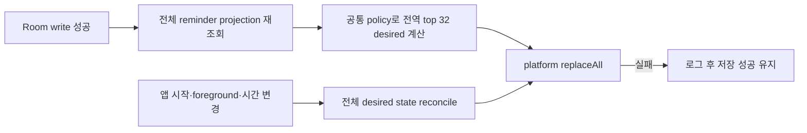

# 마감일 기반 로컬 알림 구현 전략

- 작성일: 2026-08-09
- 관련 이슈: [#211 목표 마감일 기반 로컬 알림 도입](https://github.com/Nexters/BandalArt-KMP/issues/211)
- 기준 commit: `0058885c`
- 조사 근거: [마감일 기반 로컬 알림 조사](LOCAL_DEADLINE_NOTIFICATION_RESEARCH.md)

## 현재 진행률 체크리스트

2026-08-09 기준 로컬 구현 완료와 실제 출하 완료를 분리해 기록한다. 아래 `예정 PR`은 구현 전략의 분할 단위이며 아직 생성된 GitHub PR이 아니다. 모든 항목은 아직 Android Internal이나 iOS TestFlight에 포함되지 않았다.

### 예정 PR 1 — 조사·전략

- [x] 공식 API와 저장소 접점 조사를 로컬 문서로 작성했다.
- [x] 제품 시간·집계·권한·reconcile 정책과 PR 분할 전략을 로컬에서 검토했다.
- [ ] 조사·전략 문서를 commit하고 PR을 생성해 CI 통과 후 `main`에 병합한다.

### 예정 PR 2 — 공통 foundation

- [x] main cell due date의 full-snapshot 삭제 의미, notification preference, reminder projection·parser·planner·batch와 scheduler/authorization/reconciler 계약을 로컬에서 구현했다.
- [x] 공통 foundation 변경을 로컬 리뷰하고 관련 테스트를 통과시켰다.
- [ ] 공통 foundation을 commit하고 PR을 생성해 CI 통과 후 `main`에 병합한다.

### 예정 PR 3 — Android vertical slice

- [ ] WorkManager scheduler·Worker·channel·permission adapter를 구현한다.
- [ ] 시간 변경 reconcile과 cold/warm notification navigation을 구현·검증한다.
- [ ] Android Internal 설치본에서 실제 권한과 전달을 검증한다.

### 예정 PR 4 — iOS vertical slice

- [ ] UserNotifications scheduler·authorization adapter를 구현한다.
- [ ] AppDelegate delegate, launch-target bridge와 pending/delivered reconcile을 구현·검증한다.
- [ ] TestFlight 설치본에서 실제 권한과 전달을 검증한다.

### 예정 PR 5 — UX 활성화·배포 검증

- [ ] 설정 toggle·권한 상태·시스템 설정 action과 명시적 마감일 삭제 UX를 구현한다.
- [ ] 한국어·영어·일본어 문구와 접근성을 검증한다.
- [ ] Android Internal과 iOS TestFlight의 전체 acceptance checklist를 완료한다.
- [ ] #211 완료 조건 확인 뒤 umbrella issue를 닫는다.

## 1. 목표

- 사용자가 설정에서 직접 기능을 켠 경우에만 OS 알림 권한을 요청한다.
- 제목과 마감일이 있고 완료되지 않은 main/sub/task 셀을 기기 현지 시각 오전 9시를 목표로 마감일 당일에 알린다.
- 날짜 변경·제거, 완료·완료 취소, 셀 초기화, 반다라트 삭제 뒤 오래된 알림을 남기지 않는다.
- 서버, FCM, APNs remote push 없이 Android/iOS의 로컬 scheduler만 사용한다.
- 권한 거절이나 플랫폼 예약 실패가 이미 성공한 셀 저장을 실패시키지 않는다.
- 알림을 누르면 해당 반다라트를 선택한 Home으로 이동한다. 셀 편집창 직접 열기는 v1 범위가 아니다.

## 2. 선행 수정

기존 `BandalartDao.updateMainCellWithDto()`는 `dueDate = updateDto.dueDate ?: current.dueDate`로 처리했다. UI에서 main 셀 날짜를 제거해 `null`을 보내도 기존 날짜가 유지됐으므로 foundation에서 due date를 title·description과 다른 full-snapshot 값으로 정의한다. 현재 Home 저장 경로는 기존 날짜를 유지할 때도 현재 `dueDate`를 전달하고, 삭제할 때만 `null`을 전달한다. 따라서 `null = 제거`이며 별도의 `미변경` 상태는 없다. 향후 due date를 생략하는 partial caller가 필요하면 세 상태를 표현하는 별도 patch 타입을 먼저 도입해야 한다.

foundation 단계에서 main cell update DTO의 due date snapshot 의미를 바로잡고 다음을 회귀 테스트한다.

- main 셀 날짜 제거가 Room과 UI에 실제 반영된다.
- title/description의 기존 patch 의미는 의도치 않게 바뀌지 않는다.
- 날짜 제거 뒤 reminder desired state에서 해당 셀이 제외된다.

현재 날짜 피커의 `초기화`는 날짜 삭제가 아니라 오늘 날짜 선택이다. UX 활성화 단계에서 main/sub/task 공통으로 명시적인 `마감일 삭제` action을 추가하고, 기존 action은 실제 의미에 맞는 문구로 바꾼다.

## 3. 제품 정책

### 3.1 시간

- 기준 목표 시각은 due date의 기기 현지 시각 오전 9시다.
- Android WorkManager의 09:00은 실행 가능한 가장 이른 시각이며 실행 상한이 없다. v1의 사용자·완료 문구는 `마감일 당일 알림`이고, 09:00 정각 또는 오전 전달을 보장하지 않는다.
- 예약을 새로 계산하는 시점에 오늘 09:00이 이미 지났다면 새 request를 만들지 않는다. 09:00 전에 예약된 Android work가 앱이 background인 동안 지연되면 due date 당일 안에서만 표시할 수 있지만, 09:00 이후 foreground reconcile이 실행되면 사용자가 이미 앱을 보고 있으므로 그 pending work를 취소한다. 다음 날 실행된 stale work도 폐기한다.
- `dueDate`는 UTC instant가 아니라 현지 달력 날짜로 해석한다. 저장 형식은 기존 `yyyy-MM-dd'T'HH:mm`을 그대로 유지하며 #211에서 date-only 저장 migration을 하지 않는다. reminder projection만 현재 datetime과 기존 데이터·테스트의 초 포함 datetime 변형을 읽어 `LocalDate`로 정규화하고, 파싱할 수 없는 값은 제외한다.

### 3.2 적격 셀

다음 조건을 모두 만족할 때만 reminder item을 만든다.

- 셀이 Room에 존재한다.
- 제목을 trim한 결과가 비어 있지 않다.
- due date를 달력 날짜로 파싱할 수 있다.
- 셀이 완료되지 않았다.
- due date의 현지 09:00 목표 시각이 reconcile 시점보다 미래다.
- 사용자의 마감일 알림 preference가 ON이다.

main 목표의 알림 원본은 중복된 `bandalarts.dueDate`가 아니라 안정적인 cell ID가 있는 `bandalart_cells`로 통일한다.

### 3.3 같은 날 여러 목표

플랫폼 예약 단위는 셀별이 아니라 `(bandalartId, dueDate)` batch다. desired batch는 due date, bandalart ID 순으로 정렬하고 두 플랫폼 모두 가까운 32개까지만 예약한다. `32`는 문서화되지 않은 iOS 상한을 추정하는 값이 아니라 무제한 pending을 피하기 위한 v1 제품 제한이다.

```kotlin
data class DeadlineReminderBatch(
    val id: String, // deadline.v1.board.<bandalartId>.date.<yyyy-MM-dd>
    val bandalartId: Long,
    val dueDate: LocalDate,
    val items: List<DeadlineReminderItem>,
)
```

- 한 건이면 `{목표명}을 완료할 시간이에요.`를 표시한다.
- 두 건 이상이면 `{count}개의 목표가 오늘 마감이에요.`를 표시한다.
- batch를 누르면 그 batch의 반다라트를 선택한다.
- 서로 다른 반다라트의 batch를 하나의 Android group summary로 묶지 않는다. summary tap에는 하나의 올바른 반다라트를 선택할 수 없고 별도 lifecycle이 필요하기 때문이다.
- iOS `threadIdentifier`도 count summary 계약으로 사용하지 않는다. 각 board/date batch가 자체 집계 문구와 tap 목적지를 가진다.
- 32개를 넘는 batch는 가까운 순서로 대기 상태가 된다. app-scoped scheduling health에 overflow count를 노출하고 설정 화면에 `먼 날짜 알림 N개는 아직 예약되지 않음`을 표시한다.
- mutation, 앱 시작, foreground, 시간 변경 reconcile에서 만료된 batch를 제거하고 다음 가까운 batch로 refill한다. 사용자가 장기간 앱을 다시 열지 않으면 대기 batch가 예약되지 않을 수 있음을 v1 제한으로 명시한다.
- 플랫폼 add가 32개 이전에 실패하면 성공한 batch 수와 overflow를 health에 반영하고 같은 순서를 유지한다. 순서를 바꿔 가까운 알림을 starvation시키지 않는다.

## 4. source of truth와 reconcile

Room의 현재 셀 상태와 DataStore의 사용자 preference만 durable source of truth다. WorkManager work와 iOS pending/delivered notification은 삭제 후 재생성할 수 있는 파생 상태다.

### 4.1 공통 흐름



- task write는 DAO가 parent sub/main 완료까지 자동 변경하므로 변경 셀 하나만 schedule/cancel하지 않는다.
- 모든 관련 write 성공 뒤 전역 projection과 가까운 32개를 다시 계산해 `replaceAll()`한다. 한 반다라트의 가까운 일정이 다른 반다라트의 먼 예약을 즉시 퇴출하거나, 삭제된 일정 자리에 overflow batch를 refill할 수 있어야 하기 때문이다.
- sub/task reset과 main/반다라트 삭제도 같은 전역 reconcile 경계를 사용한다.
- 설정 ON은 전체 reconcile, OFF는 기능 namespace의 pending/delivered 상태 전체 제거다.
- 앱 시작과 foreground 복귀는 이전 예약 실패, 앱 업데이트와 시스템 설정 변경을 복구하기 위해 전체 reconcile한다.
- reconcile은 app-scoped mutex로 직렬화한다. 동시에 실행된 오래된 desired state가 최신 예약을 덮지 않게 한다.

### 4.2 공통 계약

`core/domain`에 플랫폼 SDK 타입이 없는 계약을 둔다.

- `DeadlineReminderItem`, `DeadlineReminderBatch`
- legacy/new due date를 정규화하는 parser
- Clock/TimeZone을 주입받는 eligibility/planner
- `DeadlineReminderScheduler`
  - `replaceAll(batches)`
  - `clearAll()`
- `DeadlineNotificationAuthorization`
  - 현재 상태 조회
  - 명시적 사용자 action에서의 요청
  - OS 알림 설정 열기
- `DeadlineReminderReconciler`
  - `reconcileAll()`
  - 예약 오류를 Room write와 분리하는 best-effort 경계
- `DeadlineReminderSchedulingHealth`
  - scheduled count, overflow count, 마지막 platform error category
  - 설정 화면의 degraded 상태와 capacity 회귀 테스트 입력

전체/반다라트별 reminder projection은 별도 repository로 두어 기존 `BandalartRepository`의 UI CRUD 계약을 notification query로 비대하게 만들지 않는다.

## 5. 설정과 권한 상태

DataStore의 `deadlineReminderEnabled`는 사용자의 의사이며 OS authorization과 별도다. 공통 effective 상태는 `Unsupported`, `Requestable`, `Granted`, `Quiet`, `Blocked`로 정규화한다.

1. 기본값은 OFF다.
2. 사용자가 toggle을 누르면 오전 9시를 목표로 한 당일 알림과 잠금 화면 제목 노출을 설명한다.
3. `Requestable`일 때만 prompt를 요청한다.
4. `Granted` 또는 `Quiet`이면 preference를 ON으로 저장하고 전체 reconcile한다.
5. 최초 요청이 거절·dismiss되면 preference는 OFF로 유지하고 due date 저장 등 다른 기능은 그대로 제공한다. 결과 뒤 public permission flag와 rationale을 다시 읽어 재요청 가능 여부를 갱신한다.
6. ON 이후 사용자가 시스템 설정에서 권한 또는 Android channel을 끄면 사용자 의도는 유지한다. 설정 UI에는 `시스템 알림 꺼짐`과 설정 이동 action을 표시하고 플랫폼 예약은 정리한다.
7. OS 설정에서 다시 허용한 뒤 foreground로 돌아오면 상태를 재조회하고 전체 reconcile한다.
8. toggle OFF는 preference 저장 후 pending/delivered notification을 모두 정리한다.

권한 prompt는 Presenter의 app-scoped service에서 임의로 띄우지 않는다. Android는 화면 lifecycle을 가진 Compose effect/Activity Result API가 담당하고 iOS는 설정 action이 호출한 permission adapter가 담당한다.

- Android 13 이상은 `checkSelfPermission`, `shouldShowRequestPermissionRationale`과 `PackageManager`의 public `FLAG_PERMISSION_USER_SET`/`FLAG_PERMISSION_USER_FIXED`를 함께 사용한다. permission이 있으면 `Granted`, user flag가 없으면 fresh install 또는 swipe dismiss로 보고 `Requestable`, rationale이 true인 일반 거절도 설명 뒤 명시적 재요청이 가능한 `Requestable`, user-fixed 또는 user-set 상태에서 rationale이 false면 `Blocked`다. Activity Result의 false만으로 Blocked를 확정하지 않는다. API 32 이하는 앱 전체 알림과 channel 상태로 `Granted`/`Blocked`를 판정한다.
- Android `Requestable` 재토글은 rationale을 먼저 보여 준 뒤 사용자가 다시 동의한 경우에만 prompt를 요청한다. `Blocked` 재토글은 prompt 없이 시스템 설정을 연다.
- iOS `notDetermined`는 `Requestable`, `authorized`는 `Granted`, `provisional`/`ephemeral` 또는 alert가 조용한 설정은 `Quiet`, `denied`는 `Blocked`로 매핑한다. sound/alert 설정은 설명 상태에 반영하되 authorization이 허용된 request 자체는 유지한다.
- 설정 복귀 때 effective 상태를 다시 읽어 `Granted`/`Quiet`이면 reconcile하고 `Blocked`면 pending 상태를 정리한다.

## 6. Android

- `androidx.work:work-runtime-ktx` 2.11.2의 `CoroutineWorker`와 one-time unique work를 사용하고 `work-testing`으로 검증한다.
- exact alarm 권한과 별도 `BOOT_COMPLETED` receiver는 추가하지 않는다. WorkManager가 persistent work를 재부팅 뒤 복원한다.
- unique work 이름과 tag는 batch/board namespace를 사용하고 교체는 `ExistingWorkPolicy.REPLACE`로 처리한다.
- `TIME_SET`, `TIMEZONE_CHANGED` receiver는 DB를 직접 오래 읽지 않고 unique reconcile work만 enqueue한다.
- Android 13 이상 `POST_NOTIFICATIONS` runtime permission과 API 26 이상 `deadline_reminder` channel을 사용한다.
- Worker는 input title을 그대로 게시하지 않고 실행 직전 Room에서 해당 board/date의 현재 적격 item을 다시 조회한다.
- 설정 OFF, 권한/channel 차단, 삭제·완료·날짜 변경, 잘못된 날짜, 다음 날 지연 실행은 stale work로 보고 `Result.success()`로 끝낸다.
- explicit `MainActivity` pending intent에 `FLAG_UPDATE_CURRENT | FLAG_IMMUTABLE`을 사용한다.
- PendingIntent extras는 identity가 아니므로 explicit intent에 고정 action `com.nexters.bandalart.action.OPEN_DEADLINE`과 batch ID를 포함한 고유 internal data URI를 설정한다. 같은 requestCode를 사용해도 data가 다른 여러 batch의 board ID가 서로 덮이지 않아야 한다.
- `singleTask` Activity의 cold `onCreate`와 warm `onNewIntent`를 모두 처리한다.
- posted notification은 `NotificationManager.notify(batch.id, 0, notification)`의 String tag + 고정 Int ID 조합으로 식별해 Int hash 충돌을 피한다. replace/clear는 WorkManager 취소와 별도로 같은 tag를 `cancel(tag, 0)`해 이미 표시된 알림도 정리한다.

## 7. iOS

- `iosMain`에 `UNUserNotificationCenter` scheduler와 authorization adapter를 구현하고 Metro `PlatformBindings`로 주입한다.
- identifier는 `deadline.v1.*` namespace를 사용한다. replace/remove는 다른 앱 알림을 건드리는 `removeAll`이 아니라 namespace에 속한 pending/delivered request만 대상으로 한다.
- Gregorian calendar와 reconcile 시점의 `TimeZone.autoupdatingCurrent`를 명시한 one-shot `UNCalendarNotificationTrigger`에 year/month/day/09:00 components를 넣고 `nextTriggerDate`가 미래인지 확인한다. 오늘 09:00 이후에는 새 request를 만들지 않는다.
- pending request와 이미 Notification Center에 표시된 delivered notification은 별도 API로 정리한다.
- Swift `AppDelegate`가 KMP `DeadlineNotificationLaunchBridge`를 먼저 생성·강하게 소유하고 launch 완료 전에 `UNUserNotificationCenter.current().delegate`를 설정한다. 동일 bridge를 `ContentView`와 `MainViewController(bridge)`를 통해 `createIosAppGraph`에 전달한다. graph보다 먼저 도착한 cold-start response도 이 pre-graph bridge에 쌓인다.
- foreground에서도 Android와 동일하게 banner/list와 sound를 허용한다.
- `NSSystemTimeZoneDidChangeNotification`, `UIApplication.significantTimeChangeNotification`과 foreground 복귀에서 전체 reconcile한다. 앱이 종료된 동안 시간대가 바뀌면 기존 request는 과거 time-zone 기준으로 먼저 전달될 수 있으며, 다음 launch 전 완전한 보정은 보장하지 않는 v1 제한이다.
- target iOS 16.6 이상이므로 시스템 설정 이동에는 `UIApplication.openNotificationSettingsURLString`을 사용한다.
- iOS 알림 copy는 host의 한국어/영어/일본어 `Localizable.strings`에서 scheduling 시점에 해석한다. 예약 뒤 OS 언어가 바뀌면 기존 content는 유지되고 다음 reconcile에서 새 언어로 교체한다.

## 8. 알림 탭 navigation

현재 앱에는 외부 navigation request 경계가 없고, `recentBandalartId` 저장만으로는 실행 중인 Home이 즉시 전환되지 않는다.

- buffered `DeadlineNotificationLaunchTarget` 계약을 추가한다. Android는 AppGraph 수명 인스턴스를 사용하고 iOS는 AppDelegate가 graph보다 먼저 만든 bridge를 graph에 주입한다.
- Android `onCreate`/`onNewIntent`와 Swift notification delegate는 primitive `bandalartId`를 target에 기록한다.
- target은 Circuit navigator가 준비되기 전 cold-start 요청을 유지한다.
- Home Presenter는 목록 로드 뒤 target board가 존재하는지 확인하고, 존재하면 recent ID 저장과 `loadBandalart()`를 실행한 뒤 요청을 acknowledge한다.
- 삭제된 board면 요청을 소비하고 현재 Home을 유지한다.
- onboarding 미완료 상태에서는 요청을 Home 진입까지 보존한다.
- public URL scheme/intent filter와 셀 bottom sheet 직접 열기는 추가하지 않는다.

## 9. PR 분할

### PR 1 — 조사·전략

- 공식 API와 저장소 접점 조사
- 제품 시간·집계·권한·reconcile 정책 확정
- 구현/테스트/출시 단계를 문서화

### PR 2 — 공통 foundation

- main cell due date 제거 의미 수정과 DAO 회귀 테스트
- notification preference DataStore/SettingsRepository 계약
- reminder projection, parser, planner, batch ID와 eligibility 테스트
- 가까운 32개 선택, overflow health와 refill 테스트
- scheduler/authorization/reconciler 계약과 fake/no-op 구현
- 플랫폼 UI와 실제 예약은 아직 활성화하지 않음

### PR 3 — Android vertical slice

- WorkManager scheduler, Worker, channel, permission effect
- 시간·시간대 reconcile receiver
- notification publisher와 cold/warm navigation bridge
- host/Robolectric/WorkManager 테스트
- permission prompt를 포함한 실제 설정 UX 검증은 PR 5로 미루고 scheduler/Worker/navigation adapter를 직접 호출하는 자동 테스트까지만 완료

### PR 4 — iOS vertical slice

- UserNotifications scheduler/authorization adapter
- Swift AppDelegate delegate와 KMP launch-target bridge
- pending/delivered replace/cancel, foreground/time-change reconcile
- iOS compile과 scheduler/delegate bridge 계약 검증. 실제 permission prompt와 전달 수동 검증은 PR 5로 미룸
- 공통 설정 toggle은 아직 노출하지 않음

### PR 5 — UX 활성화와 배포 검증

- 설정 bottom sheet 설명·toggle·권한 상태·시스템 설정 action
- main/sub/task의 명시적 `마감일 삭제` action과 기존 `초기화` 문구 정리
- 한국어/영어/일본어 문구와 접근성
- Android Internal Testing과 iOS TestFlight에서 process kill, 재부팅/시간대, foreground, 탭 navigation 검증
- #211 완료 조건 확인 후 umbrella issue close

## 10. 테스트

### 공통 자동 테스트

- 신규/legacy/invalid due date parsing
- 과거 날짜와 오늘 09:00 이후 신규 request 제외
- 제목 없음·완료 셀 제외
- 같은 board/date batch 집계와 안정적 ID
- 날짜 변경·제거, 완료·완료 취소, sub/task reset, board 삭제 desired state
- task 완료 뒤 parent 자동 완료 반영
- 설정 OFF/ON clear/reconcile
- 가까운 32개 deterministic 선택, overflow degraded 상태와 foreground refill
- 동일 state 반복 reconcile의 idempotency
- 서로 다른 board의 33번째 가까운 batch가 가장 먼 예약을 즉시 교체하고 overflow health를 갱신
- 09:00 이후 foreground·mutation 반복 reconcile이 당일 알림을 재생성하지 않음
- Room write 성공 뒤 scheduler 실패가 저장을 롤백하지 않음
- concurrent reconcile에서 최신 desired state 유지

### Android 자동·수동 테스트

- unique replace/cancel/tag/initial delay
- Worker 실행 직전 stale state 검증
- permission 허용·거절, channel 차단
- fresh/requestable, swipe dismiss 유지, 일반 deny+rationale 재요청, user-fixed blocked와 settings-only
- Work 취소와 stable tag를 사용한 posted notification 취소
- 서로 다른 batch의 PendingIntent data identity와 board routing
- cold start와 warm `onNewIntent`
- WorkManager TestDriver, process kill, reboot, Doze/App Standby
- 동·서쪽 time zone과 수동 시각 변경

### iOS 수동·통합 테스트

- authorization 허용·거절·설정 변경
- notDetermined/authorized/provisional/denied 매핑과 재토글 무재요청
- 동일 identifier replace와 namespace pending/delivered 정리
- foreground 표시와 background/종료 상태 수신
- cold/warm notification response와 삭제된 board fallback
- time zone, DST, significant time change
- Gregorian/current time zone의 `nextTriggerDate` 전후 검증과 종료 중 time-zone 변경 제한
- scheduling 뒤 OS 언어 변경과 다음 reconcile copy 교체
- TestFlight 업데이트 후 기존 데이터의 전체 reconcile

## 11. 출시·관측

- 플랫폼 코드는 두 OS에 모두 준비될 때까지 설정 toggle을 노출하지 않는다.
- Android Internal과 iOS TestFlight에서 알림 권한과 실제 전달을 각각 검증한 뒤 활성화한다.
- scheduler/reconcile 실패는 개인정보가 없는 batch ID, platform status, error category만 기록한다. 목표 제목과 설명은 로그에 남기지 않는다.
- 알림 content에는 목표 제목 또는 집계 count만 사용하고 description, 완료 이력은 포함하지 않는다.
- pending request 수, reconcile 소요 시간과 플랫폼 add 실패를 수동/진단 로그로 확인한다. 별도 analytics SDK 추가는 비범위다.

## 12. 비범위

- FCM, APNs remote push, 서버 scheduler
- exact alarm과 오전 9시 정각 SLA
- 사용자 지정 알림 시각, 미리 알림, 반복 알림, snooze/action button
- 셀 bottom sheet 직접 deep link, public URL scheme
- 잠금 화면 내용 숨기기 옵션
- 새로운 notification analytics SDK

## 13. 완료 조건

- 기능을 직접 켜기 전에는 권한 prompt가 나타나지 않는다.
- 가까운 32개 적격 board/date batch는 두 플랫폼에서 오전 9시를 목표로 마감일 당일 best-effort 알림을 받을 수 있다.
- 32개 초과 또는 platform add 실패는 가까운 순서, overflow count와 refill 상태로 사용자에게 드러난다.
- DB 변경 뒤 오래된 pending/delivered 알림이 다음 reconcile에서 제거된다.
- Android Worker는 발송 직전 DB 상태를 재검증한다.
- 알림 탭은 cold/warm 상태 모두 올바른 반다라트를 선택한다.
- 권한 거절과 scheduler 실패가 due date 저장을 막지 않는다.
- Android/iOS 실제 기기와 Internal/TestFlight 체크리스트가 완료된다.
