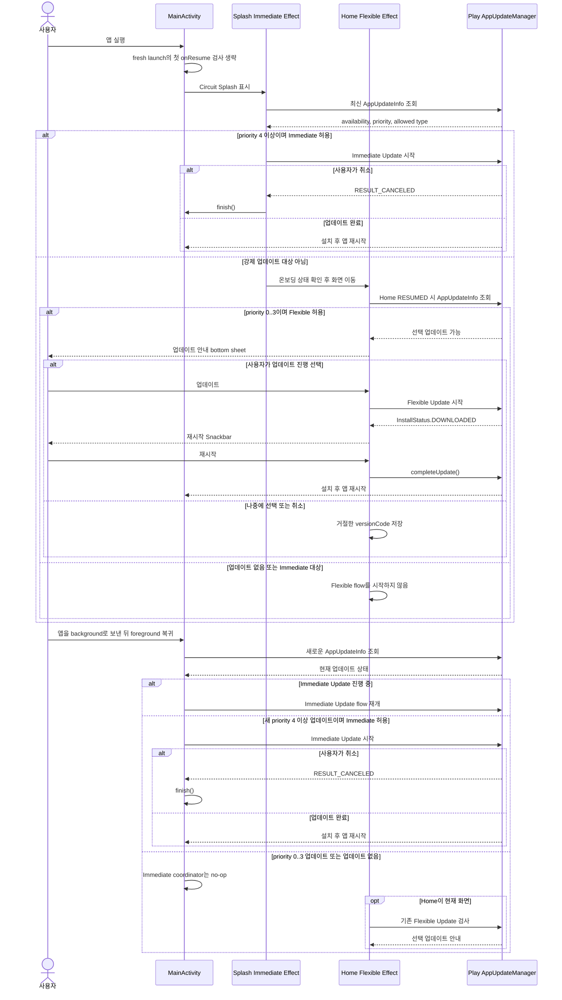

# In-App Update foreground·priority 정책 전략

- 관련 이슈: #186
- 기준 브랜치: `main`
- 대상 플랫폼: Android

## 문제

현재 업데이트 책임은 화면별로 나뉘어 있다.

- `Splash`: cold start에서 minor/major 변경을 Immediate Update로 검사한다.
- `Home`: `RESUMED`마다 patch 변경을 Flexible Update로 검사하고 다운로드 완료 Snackbar를 처리한다.

앱 프로세스가 살아 있는 상태에서 사용자가 다른 앱으로 이동했다가 돌아왔을 때 새 minor/major 업데이트가 배포되면, `Splash`는 이미 back stack에서 제거돼 Immediate Update를 다시 검사하지 않는다. `Home`의 검사는 해당 버전을 의도적으로 Flexible 대상에서 제외하므로 아무 flow도 시작하지 않는다.

PR #215에서 foreground 누락은 보강했지만 강제 여부는 여전히 versionCode의 major/minor에 묶여 있다. 이 상태에서는 일반 minor 기능도 강제 업데이트가 되고, 긴급 patch는 선택 업데이트가 된다. semantic version은 변경 범위를 표현하고 강제 여부는 운영 긴급도를 표현하므로 두 책임을 분리해야 한다.

## 성공 기준

- 새 프로세스의 cold start에서는 기존 Splash Immediate Update UX를 유지한다.
- 프로세스가 살아 있는 앱이 foreground로 복귀할 때 화면 위치와 관계없이 Immediate Update를 검사한다.
- 진행 중인 Immediate Update가 있으면 공식 가이드대로 복귀 시 재개한다.
- Flexible Update의 안내 bottom sheet, 다운로드, 설치 Snackbar 동작은 변경하지 않는다.
- 동일 resume에서 update flow를 중복 실행하지 않는다.
- major/minor/patch와 무관하게 Play release priority만으로 강제 여부를 결정한다.
- 일반 배포는 priority `0`, 긴급 업데이트만 priority `4` 이상으로 게시한다.
- 배포 후 exact versionCode·track·status뿐 아니라 priority도 Play API로 검증한다.

## 결정

전체 Flexible UI까지 앱 root로 옮기지 않고, Android `MainActivity`가 **foreground Immediate Update coordinator** 역할만 맡는다.

이유:

- foreground/background lifecycle은 화면보다 Activity가 안정적으로 소유한다.
- Onboarding, Home, Complete 중 어떤 화면에 있어도 검사할 수 있다.
- 이미 Internal Testing으로 검증한 Home Flexible Update UI와 거절 이력 저장 경로를 변경하지 않는다.
- Splash의 최초 차단 UX를 유지하면서 관측된 누락만 작게 보강한다.

강제 여부의 유일한 입력은 Play Core `AppUpdateInfo.updatePriority()`로 둔다. 공통 정책 함수는 priority `4` 이상을 mandatory로 변환하고, Splash·Activity·Home은 versionCode의 자릿수를 해석하지 않는다. versionCode는 업데이트 후보 식별과 거절 이력에만 사용한다.

## 상태 우선순위

`MainActivity.onResume()`에서 최초 fresh launch를 제외하고 새 `AppUpdateInfo`를 조회한 뒤 다음 순서를 적용한다.

1. `DEVELOPER_TRIGGERED_UPDATE_IN_PROGRESS`
   - Immediate Update flow를 재개한다.
2. `UPDATE_AVAILABLE`
   - `updatePriority() >= 4`이고 Immediate가 허용되면 flow를 시작한다.
3. 그 외
   - 아무 작업도 하지 않는다. priority `0..3`인 선택 업데이트는 Home의 기존 effect가 담당한다.

fresh launch의 첫 `onResume`은 Splash가 이미 최초 검사를 담당하므로 Activity 검사를 생략한다. saved instance state가 있는 복원 진입은 Splash가 현재 화면이라는 보장이 없으므로 첫 resume부터 검사한다.

## PR용 전체 시퀀스

핵심은 cold start의 차단 책임은 Splash, 실행 중 foreground 복귀의 강제 업데이트 책임은 Activity, priority가 낮은 선택 업데이트와 설치 완료 UI는 Home이 갖는 것이다.

## 배포 priority 계약

- Release CD의 Android 입력은 `0..5` 중 하나를 명시한다.
- 기본값은 `0`이며 일반 기능·patch 배포 모두 선택 업데이트다.
- 긴급 차단이 필요한 release만 `4` 또는 `5`를 명시한다.
- Gradle Play Publisher에도 안전한 기본값 `0`을 고정하고, workflow가 선택한 값은 publish task의 `--update-priority`로 전달한다.
- 업로드 전 source SHA·versionCode·track·status와 함께 선택한 priority를 출력한다.
- 업로드 후 Play Developer API의 exact internal release에서 `inAppUpdatePriority`를 다시 읽어 기대값과 일치해야 성공으로 처리한다. API 응답에서 priority가 생략된 경우 기본값 `0`으로 해석한다.
- Play는 rollout 뒤 priority 변경을 허용하지 않으므로, 사후 검증 실패를 기존 release 수정으로 우회하지 않고 새 versionCode로 재출시한다.

## 전환 순서

1. 현재 `2.2.x` line에 priority 기반 판정을 먼저 포함한다.
2. 이 전환 버전은 priority `0`으로 Internal·Production에 배포한다.
3. 기존 사용자의 전환 버전 보급을 확인한 뒤 `2.3.0` 같은 minor 기능 버전을 출시한다.
4. 이후 semantic version은 기능 범위만, priority는 강제 여부만 표현한다.

구버전은 여전히 major/minor 규칙을 사용하므로 전환 버전이 충분히 보급되기 전에 minor를 올리면 기존 사용자에게 Immediate flow가 표시될 수 있다.

## 중복·실패 정책

- update 정보 조회 중에는 추가 조회를 막는다.
- update flow 시작 전마다 새 `AppUpdateInfo`를 사용한다.
- Immediate 동의 화면을 사용자가 취소하면 기존 정책과 동일하게 Activity를 종료한다.
- 조회 또는 flow 시작 실패는 기록하고 다음 foreground 복귀에서 재시도한다.
- Remote Config kill switch와 staleness 정책은 이번 범위에 추가하지 않는다.

## 코드 변경

- `MainActivity`
  - `AppUpdateManager`와 Activity Result launcher 소유
  - fresh launch 구분 및 foreground resume 검사
  - 진행 중/new Immediate Update 시작
- `core/common/utils/InAppUpdate.kt`
  - Splash/Home/Activity가 공유하는 priority 기반 mandatory 정책과 임계값 정의
- `ImmediateUpdateEffect.android.kt`, `MainActivity`, `FlexibleUpdateEffect.android.kt`
  - versionCode major/minor 판정을 제거하고 `AppUpdateInfo.updatePriority()` 사용
- `androidApp/build.gradle.kts`, `Fastfile`, Release CD workflow
  - 일반 배포 기본 priority `0`, workflow 입력 전달, 업로드 전후 검증
- `play_next_version_code.py`
  - exact release의 versionCode·status·priority 검증
- `ImmediateUpdateEffect.android.kt`
  - cold start 최초 검사만 유지
  - 진행 중 update 재개 책임은 Activity로 이동

## 검증

### 자동

- priority `0..3` 선택 업데이트, `4..5` 강제 업데이트 경계 테스트
- minor priority `0`과 patch priority `4`가 versionCode와 무관하게 분류되는 회귀 테스트
- Play API priority 생략=`0`, 일치·불일치 사후 검증 테스트
- 기존 Home Presenter rejection 테스트
- 기존 Splash Presenter 중복 navigation 테스트
- Android 컴파일과 CI는 commit/push 단계에서 실행

### Internal Testing

1. priority `0` minor 버전: 기존 선택 업데이트 bottom sheet와 설치 Snackbar 유지
2. priority `4` patch 버전: cold start에서 Immediate Update 표시
3. priority `4` 배포 전 앱 실행 → background → 배포 전파 후 foreground: Immediate Update 표시
4. Immediate Update 진행 중 background/foreground: flow 재개
5. Immediate Update 취소: 앱 종료
6. Home 외 Onboarding/Complete 화면에서 foreground 복귀: Immediate Update 표시

## 공식 참고

- https://developer.android.com/guide/playcore/in-app-updates/kotlin-java
- https://developer.android.com/reference/com/google/android/play/core/appupdate/AppUpdateInfo
- https://developers.google.com/android-publisher/api-ref/rest/v3/edits.tracks
- `AppUpdateInfo`는 update flow 시작마다 새 인스턴스를 조회해야 한다.
- Immediate Update가 진행 중이면 앱이 foreground로 돌아올 때 flow를 재개해야 한다.
